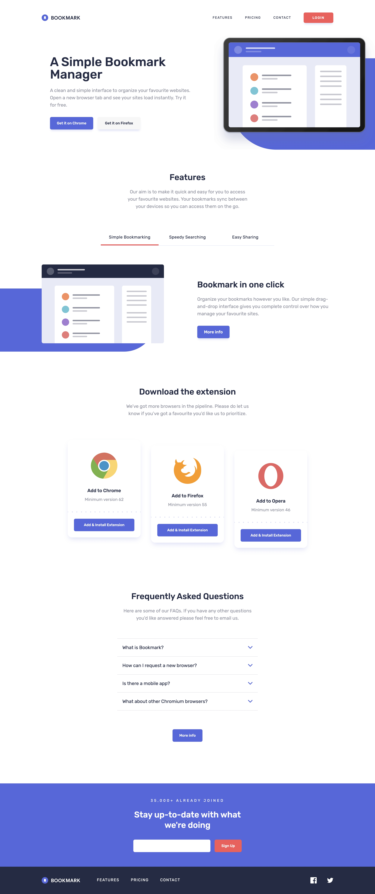
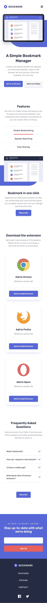
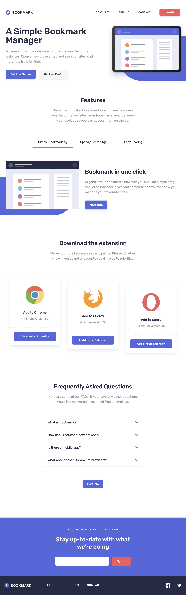

# Frontend Mentor - Bookmark landing page solution

This is a solution to the [Bookmark landing page challenge on Frontend Mentor](https://www.frontendmentor.io/challenges/bookmark-landing-page-5d0b588a9edda32581d29158). Frontend Mentor challenges help you improve your coding skills by building realistic projects.

## Table of contents

- [Frontend Mentor - Bookmark landing page solution](#frontend-mentor---bookmark-landing-page-solution)
  - [Table of contents](#table-of-contents)
  - [Overview](#overview)
    - [The challenge](#the-challenge)
    - [Screenshot](#screenshot)
    - [Links](#links)
  - [My process](#my-process)
    - [Built with](#built-with)

## Overview

### The challenge

Users should be able to:

- View the optimal layout for the site depending on their device's screen size
- See hover states for all interactive elements on the page
- Receive an error message when the newsletter form is submitted if:
  - The input field is empty
  - The email address is not formatted correctly

### Screenshot

Desktop

Mobile

Tablet

### Links

- [Live Site URL](https://bookmark-landing-page.frilly.dev/)

## My process

This is a very simple landing page, only a few stuff needed to be taken care of like the little blue blob backgrounds are HTML elements, and not in the SVGs provided.

### Built with

- [React](https://reactjs.org/)
- [Tailwind CSS](https://tailwindcss.com/)
- [Astro](https://astro.build/)
